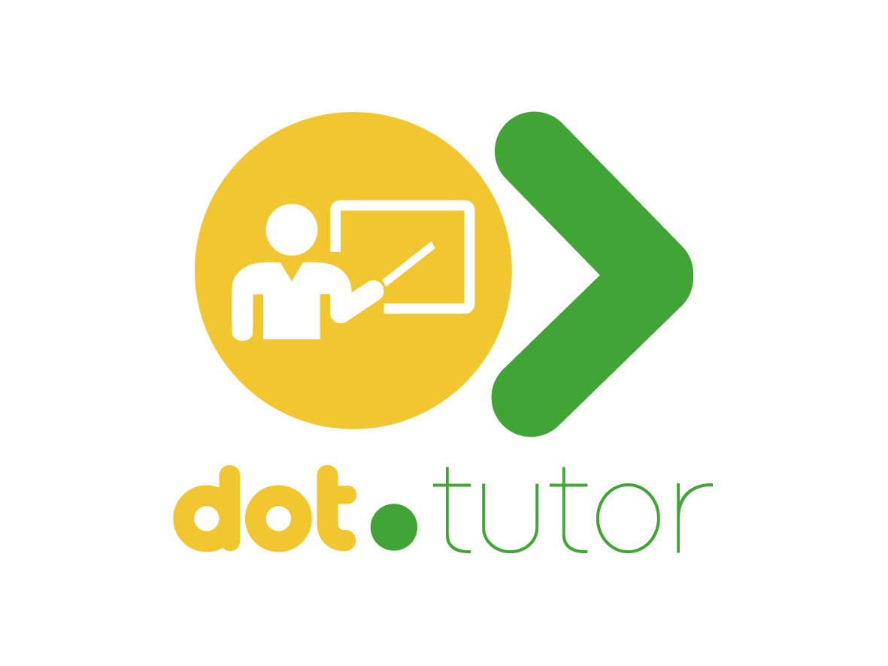

<div align="center">



<h1>Dot.Tutor</h1>

<p>Tutoring platform — find expert tutors, book sessions, and learn online or in person.</p>

[](https://php.net)
[](https://laravel.com)
[](https://livewire.laravel.com)
[](https://postgresql.org)
[](tests/)
[](LICENSE)

</div>

---

## Overview

Dot.Tutor is the tutoring and session booking platform in the Dot ecosystem. Students find approved tutors by subject and level, book online or in-person sessions, access lesson resources, and rate their experience — while tutors manage their availability, subjects, and earnings.

---

## Features

- **Tutor profiles** — bio, hourly rate, subjects, and approval status (pending/approved/suspended)
- **Subject matching** — find tutors by subject and level (primary, high school, university)
- **Session booking** — request, confirm, and manage sessions with duration and rate
- **Delivery modes** — online or in-person sessions
- **Lesson resources** — tutors attach files and materials per session
- **Ratings** — post-session ratings with written review
- **Tutor dashboard** — upcoming sessions, earnings summary, and student history
- **Ecosystem SSO** — authenticate from InfoDot with a single click

---

## Domain Model

```
Subject       ← tutor_subject → TutorProfile → User
TutorSession  (table: tutor_sessions) → TutorProfile + Student + Subject
             → LessonResources
             → SessionRating
```

> Note: The sessions table is named `tutor_sessions` to avoid conflict with Laravel's default session driver table.

---

## Tech Stack

| Layer | Technology |
|---|---|
| Framework | Laravel 12 + PHP 8.4 |
| Frontend | Livewire 3 + Alpine.js + Tailwind CSS |
| Auth | Jetstream 5 + Sanctum (ecosystem SSO) |
| Database | PostgreSQL 16 (shared infodot instance) |
| Payments | Laravel Cashier + Stripe |
| WebSockets | Laravel Reverb |

---

## Quick Start

```bash
git clone https://github.com/sakhileb/Dot.Tutor.git && cd Dot.Tutor
composer install && npm install
cp .env.example .env && php artisan key:generate
php artisan migrate && npm run dev & php artisan serve
```

```bash
bash bin/test.sh   # 37 passing, 0 failed, 7 skipped
```

---

## Part of the Dot Ecosystem

Dot.Tutor connects to [InfoDot](https://github.com/sakhileb/InfoDot) — the central hub. Log in to InfoDot once and navigate here without re-authenticating via `/auth/ecosystem`.

---

MIT — © SK Digital / BluPin Incorporated
